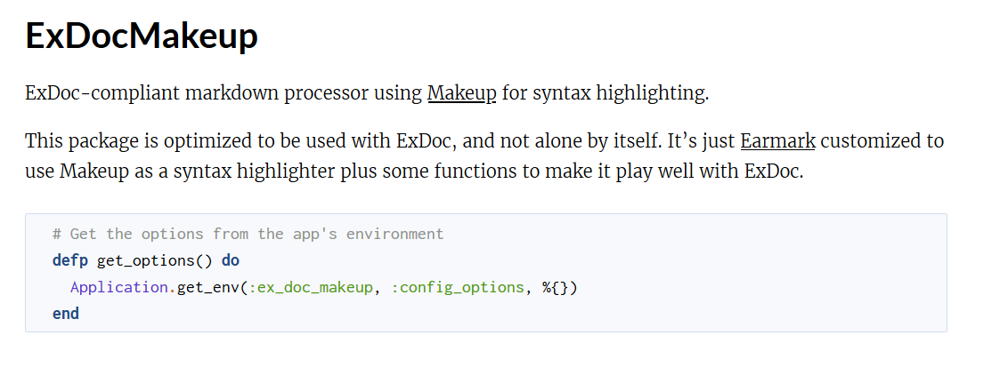

# ExDocMakeup

The default syntax highlighting used by ExDoc is not very good.

ExDocMakeup is a custom markdown processor that is meant to be used together with ExDoc.
It brings syntax highlighting by [Makeup](https://hexdocs.pm/makeup/Makeup.html)
([demo here](https://tmbb.github.io/makeup_demo/elixir.html)) to your package's documentation.
Makeup is a pure Elixir library to make your code prettier.

Makeup's syntax highlighting is much better than the default syntax highlighting used by ExDoc,
which is based on the [highlight.js](https://highlightjs.org) javascript library.

This package highlights the elixir code in your documentation, while using highlight.js
for languages it can't yet highlight.

**Note:**
Makeup colors your code using pure HTML and CSS, but it uses Javascript for further enhancements.
When you place the mouse cursor over a delimiter (`[`, `]`, `%{` `{`, `}`, etc.)
or a keyword such as `do`, `end`, `fn`, etc., it highlights the matching delimiter or keyword.
Except for this feature, syntax highlighting will work perfectly well without Javascript.

## Installation

This package is [available in Hex](https://hexdocs.pm/ex_doc_makeup).

It can be installed by adding `ex_doc_makeup` to your list of dependencies in `mix.exs`:

```elixir
def deps do
  [
    ...
    # Note the ex_doc version, it won't work with earlier versions
    {:ex_doc, ">= 0.18.1", only: :dev},
    {:ex_doc_makeup, "~> 0.1.0", only: :dev}
  ]
end
```

To configure ExDoc to use ExDocMakeup for better syntax highlighting,
add the following to your `:docs` key:

```elixir
  docs: [
    ...
    markdown_processor: ExDocMakeup,
    ...
  ]
```

When you run `mix docs`, `ex_doc` will use this package for better syntax highlighting.

## CSS Style

The style is what I have decided to call the *Samba Theme*.
It is a slightly customized mixture of two themes, shamelessly stolen from Pygments.

  * the *Tango* theme for the *Day Mode*.
    This theme is based on the color palette from the
    [Tango Icon Theme Guidelines](http://tango.freedesktop.org/Tango_Icon_Theme_Guidelines).

  * the *Paraíso Dark* theme for the *Night Mode*;
    This theme was created by by [Jan T. Sott](https://github.com/idleberg)
    with the [Base16 Builder](https://github.com/chriskempson/base16-builder)
    by [Chris Kempson](https://github.com/chriskempson).
    It was originally inspired by the work of Brazilian artist Rubens LP.

Both themes are owned by the Pygments team and were published under the BSD license.

ALthough the theme is different from the default one used by ExDoc,
it works well with the default color scheme used by ExDoc.

### Naming

The first theme is named after an Argentinian dance,
and the second one is named after a Brazilian artist.
*Samba*, a Brazilian dance, is an appropriate name for the mixture of the two themes.

The fact that the CSS Theme is named after a Portuguese word is not a coincidence.
It's part of my effort to further the agenda of the Great Software Brazilian Conspiracy,
as I've [once promised José Valim](https://elixirforum.com/t/discussion-about-syntax-preferences-split-posts/3436/81).

## Experimental Features

The ability to pass additional keywords has been removed for performance reasons.
It might be added in future versions.

### Markdown Plugins

The focus of ExDocMakeup is always syntax highlighting, of course.
But then I started wondering: I already have a custom markdown implementation included in ExDocMakeup.
Up until now, it only highlighted the code and nothing else.
However, Earmark, the undelying Markdown processor is extensible.
This means I can use it to experiment with other features that may not be desirable for inclusion in ExDoc itself.

Besides being used for API documentation, ExDoc can also be used to author general documents about Elixir (i.e "Guides").
Guides often need to incorporate code fragments, but they may contain bugs, or for that matter, contain syntax errors that make them impossible to compile.

Enter the `include` directive. It allows you to include fragments of code taken from files.

By extracting the code directly from the files, you guarantee that everything is up to date.
Besides that, you can also apply normal quality control to the code fragments (coverage, static analysis, unit testing, test whether the code actually compiles, etc.).

the `include` directive is invoked inside the markdown file.
It's a standard Earmark plugin (Earmark is the markdown implementation behind ExDoc and ExDocMakeup).
Like all plugins, it must appear in a line all by itself, starting with `$$`. Currently ExDocMakeup supports:

#### Include an entire file

The syntax is just the same as a normal Elixir function call

```
$$ include "lib/my_file.ex"
```

#### Include a range of lines (inclusive)

The syntax is the same; just add the `:lines` option with a line range:

```
$$ include "lib/my_file.ex", lines: 45..67
```

This is inconvenient because line numbers may change if you change the contents of the file, but people might find use for it in any case.

#### Include a block of code:

To include a block of code, independent on the line numbers, you must delimit it with special comments `#! begin: block_name` and `#! end: block_name`.
There has to be exactly 1 whitespace character between the `#` and the `!`.
For example:

```elixir
...
# !begin: my_func
def my_func(x), do: x + x
# !end: my_func
...
```

To include the block above, use the `:block` option, with the block name:

```
$$ include "lib/my_file.ex", block: "my_func"
```

This options is mutually exclusive with the `:lines` option (it wouldn't make sense otherwise).
Personally, I prefer the block format because unlike line numbers, it doesn't change when you edit the file

#### Configuring the language

Include some Elixir code (the default):

```
$$ include "lib/my_file.ex", lines: 55..66, lang: "elixir"
```

Include some Python code:

```
$$ include "lib/external/monty.py", block: "my_python_class", lang: "python"
```

The `:lang` option will be passed to the syntax highlighter.
Currently, ExDocMakeup only supports Elixir code, so other languages will be passed to Highlight.js.

#### Safety

The directive is a normal Elixir function call, extracted using `Code.string_to_quoted` and then evaluated by a mini-interpreter.
This is on purpose: supporting arbitrary Elixir here doesn't seem very smart; you'd get scoping issues and additional attack vectors.
The current implementation is probably not 100% safe yet, and it's possible that you can execute arbitrary code in the machine generating the docs.
It probably needs further restrictions on the datatypes that can be passed as arguments.
This shouldn't be much of a problem, because if you're running the docs it you are already compiling arbitrary (possibly untrusted) Elixir code.
This just means you need to review the docs somewhat more carefully.

#### Example

Suppose you have the following module doc:

```elixir
defmodule ExDocMakeup do
  @moduledoc """
  ExDoc-compliant markdown processor using [Makeup](https://github.com/tmbb/makeup) for syntax highlighting.

  This package is optimized to be used with ExDoc, and not alone by itself.
  It's just [Earmark](https://github.com/pragdave/earmark)
  customized to use Makeup as a syntax highlighter plus some functions to make it
  play well with ExDoc.

  $$ include "lib/ex_doc_makeup/code_renderer.ex", block: "get_options"
  """
```

And the `lib/ex_doc_makeup/code_renderer.ex` file contains the following fragment:

```elixir
...

  #! begin: get_options
  # Get the options from the app's environment
  defp get_options() do
    Application.get_env(:ex_doc_makeup, :config_options, %{})
  end
  #! end: get_options
...
```

When run `mix docs`, ExDocMakeup will fetch the appropriate fragment, and render:



Although I show an example of running the directive inside a `@moduledoc` attribute, it's probably more useful when running it on standalone markdown files, like guides or additional pages.

#### Feedback?

What do you think of this API?
What do you think of the block delimiters (`#! begin:` and `#! end:`)?
What other features would you like to have?

#### Inspiration

This feature was inspired by a similar feature in Sphinx, the main python documentation tool: http://www.sphinx-doc.org/en/stable/
