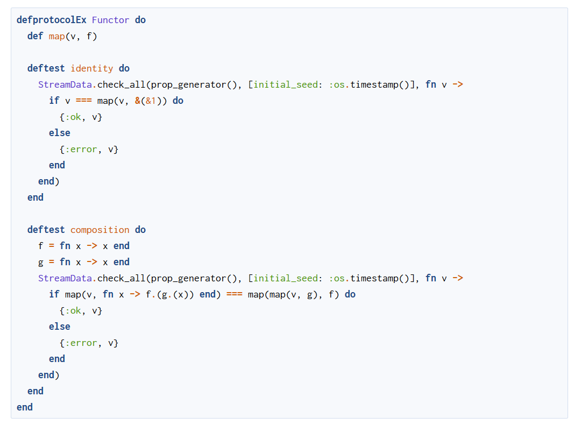
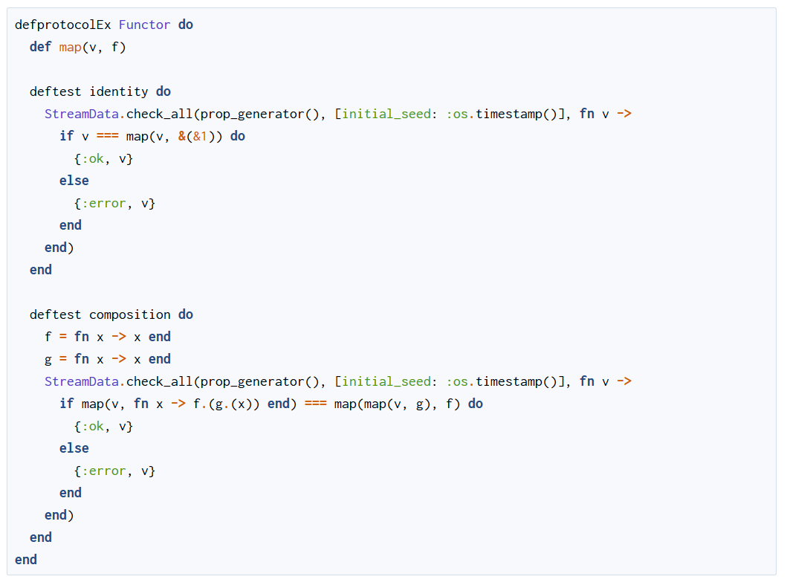

# ExDocMakeup

The default syntax highlighting used by ExDoc is not very good.

ExDocMakeup is a custom markdown processor that is meant to be used together with ExDoc.
It brings syntax highlighting by [Makeup](https://hexdocs.pm/makeup/Makeup.html)
([demo here](https://tmbb.github.io/makeup_demo/elixir.html)) to your package's documentation.
Makeup is a pure Elixir library to make your code prettier.

Makeup's syntax highlighting is much better than the default syntax highlighting used by ExDoc,
which is based on the [highlight.js](https://highlightjs.org) javascript library.

This package highlights the elixir code in your documentation, while using highlight.js
for languages it can't yet highlight.

**Note:**
Makeup colors your code using pure HTML and CSS, but it uses Javascript for further enhancements.
When you place the mouse cursor over a delimiter (`[`, `]`, `%{` `{`, `}`, etc.)
or a keyword such as `do`, `end`, `fn`, etc., it highlights the matching delimiter or keyword.
Except for this feature, syntax highlighting will work perfectly well without Javascript.

## Installation

This package is [available in Hex](https://hexdocs.pm/ex_doc_makeup).

It can be installed by adding `ex_doc_makeup` to your list of dependencies in `mix.exs`:

```elixir
def deps do
  [
    ...
    # It requires a recent version of `:ex_doc`
    {:ex_doc, "~> X.X.X", only: :dev},
    {:ex_doc_makeup, "~> 0.1.0", only: :dev}
  ]
end
```

To configure ExDoc to use ExDocMakeup for better syntax highlighting,
add the following to your `:docs` key:

```elixir
  docs: [
    ...
    markdown_processor: ExDocMakeup,
    ...
  ]
```

When you run `mix docs`, `ex_doc` will use this package for better syntax highlighting.


## Advanced Options

*(this API should be considered unstable; the option names might change in the future)*

It's possible to configure Makeup to highlight some custom keywords
through the `:lexer_options` keyword, which lives under the `:markdown_processor_options` keyword.
There are two kinds of keywords that can be highlighted:

  * `extra_def_like` - a list of keywords that should be highlighted just like
    `def`, `defp`, `defmacro`, etc.
    These keywords are not only highlighted as keywords, but the identifier
    that comes after them is highlighted as a function name in a function definition.
    You may this option to define keywords that define functions or macros
    (i.e. macros that expand to `def` or `defmacro`)

  * `extra_declarations` - a list containing other keywords that should be highlighted
    like `defmodule`, `def`, etc.
    They are highlighted alone and have no effect the highlighting of other tokens.
    You may use this function for macros that expand to `defmodule`.

To configure these options, add the following to your `:docs` key:

```elixir
  docs: [
    ...
    markdown_processor: ExDocMakeup,
    markdown_processor_options: [
      # `lexer_options` should be a map (not a keyword list!)
      lexer_options: %{
        # These options belong to the lexer for the "elixir" language
        "elixir" => [
          # Keywords as explained above (will be used by Makeup)
          extra_def_like: [...],
          extra_declarations: [...]],
      }
    ]
    ...
  ]
```

**A word of warning:**
Judicious use of these options may enhance readability, but be sure to use them
only when they make sense.
The goal of syntax highlighting is to make it clearer what is going on in the code.
Be careful to only highlight as keywords things what actually *work* like `def` or `defmodule`
behind the scenes.
If you use these feature in an abusive way, you may actually deceive the reader.

### Example

Because the above is a little abstract, let's illustrate it with a concrete example.

The [ProtocolEx](https://hexdocs.pm/protocol_ex/readme.html) package,
by [OvermindDL1](https://github.com/OvermindDL1), defines some macros that expand to
`def`, `defmacro` or `defmodule`.
The highlighted source is more readable and more consistent if those keywords
are highlighted like `def` or `defmodule`.
To enhance readability, we can pass the following options:

```elixir
  docs: [
    ...
    markdown_processor: ExDocMakeup,
    markdown_processor_options: [
      lexer_options: %{
        "elixir" => [
          extra_declarations: [
            "defimplEx", "defimpl_ex",
            "defprotocolEx", "defprotocol_ex"],
          extra_def_like: ["deftest"]]
      }
    ],
    ...
  ]
```

This produces the following results:



You can see that:

  * the `:extra_declaration` keywords are highlighted as keywords and

  * the `:extra_def_like` keyword (`deftest`) is highlighted like
    the `def` keyword and the identifier that follows it is highlighted
    like a function name

Without these configuration options, the keywords are highlighted like a normal
identifier:



## CSS Style

The style is what I have decided to call the *Samba Theme*.
It is a slightly customized mixture of two themes, shamelessly stolen from Pygments.

  * the *Tango* theme for the *Day Mode*.
    This theme is based on the color palette from the
    [Tango Icon Theme Guidelines](http://tango.freedesktop.org/Tango_Icon_Theme_Guidelines).

  * the *Paraíso Dark* theme for the *Night Mode*;
    This theme was created by by [Jan T. Sott](https://github.com/idleberg)
    with the [Base16 Builder](https://github.com/chriskempson/base16-builder)
    by [Chris Kempson](https://github.com/chriskempson).
    It was originally inspired by the work of Brazilian artist Rubens LP.

Both themes are owned by the Pygments team and were published under the BSD license.

ALthough the theme is different from the default one used by ExDoc,
it works well with the default color scheme used by ExDoc.

### Naming

The first theme is named after an Argentinian dance,
and the second one is named after a Brazilian artist.
*Samba*, a Brazilian dance, is an appropriate name for the mixture of the two themes.

The fact that the CSS Theme is named after a Portuguese word is not a coincidence.
It's part of my effort to further the agenda of the Great Software Brazilian Conspiracy,
as I've [once promised José Valim](https://elixirforum.com/t/discussion-about-syntax-preferences-split-posts/3436/81).